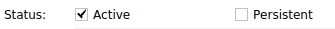

# PolygonMeshVirtualFixture


This is the offical repo for our work [Anatomical Mesh-Based Virtual Fixtures for Surgical Robots](https://arxiv.org/abs/2006.02415) accepted in IROS 2020. We present a framework to automatically generate complex virtual fixtures for arbitrary geometries given a polygon mesh (STL) file. The framework is applicable to all CISST-based robots. This repo contains [an interactive demo]() as well as example code of the virtual fixture working with dVRK.


If you use our code, please cite
```
@article{li2020anatomical,
  title={Anatomical Mesh-Based Virtual Fixtures for Surgical Robots},
  author={Li, Zhaoshuo and Gordon, Alex and Looi, Thomas and Drake, James and Forrest, Christopher and Taylor, Russell H},
  journal={arXiv preprint arXiv:2006.02415},
  year={2020}
}
```
## System Requirement
We have tested the code functionality on **Ubuntu 16.04 and 18.04**.

## Dependencies
- **3D Slicer**: We use 3D Slicer as a front end for visualization. It is required to use 3D Slicer 4.8.1 for OpenIGTLink compatibility. To download, please use link [here](http://slicer.kitware.com/midas3/download/item/330417/Slicer-4.8.1-linux-amd64.tar.gz).
- **ROS**: To install ROS, pleaes follow instruction [here](http://wiki.ros.org/melodic/Installation/Ubuntu)
- **Third-Party Packages**: Please install by
```sh
sudo apt install libxml2-dev libraw1394-dev libncurses5-dev qtcreator swig sox espeak cmake-curses-gui cmake-qt-gui git subversion gfortran libcppunit-dev libqt5xmlpatterns5-dev # most system dependencies we need
sudo apt install python-wstool python-catkin-tools # catkin and wstool for ROS build
```

## Compilation
Please follow the following system command
```sh
source /opt/ros/melodic/setup.bash # or use whatever version of ROS is installed!
mkdir ~/catkin_ws # create the catkin workspace
cd ~/catkin_ws # go in the workspace
wstool init src # we're going to use wstool to pull all the code from github
catkin init
cd src # go in source directory to pull code
git clone https://github.com/mli0603/PolygonMeshVirtualFixture.git dvrk_mesh_vf # clone the code in a folder called dvrk_mesh_vf
wstool merge dvrk_mesh_vf/ros/dvrk_mesh_vf.rosintall # add required repos
wstool up # now wstool knows which repos to pull, let's get the code
catkin build # ... and finally compile everything
```

## To run the demo
### Visualization
- Launch 3D slicer with the scene file located at `scene/Demo-Scene.mrml`. You should see a scene with pediatric skull and two spheres (red and blue, but the spheres may overlap in the beginning so you only see one). The red sphere represents the servoed position (i.e. commanded position from the MTM or keyboard) and the blue sphere represents the measured position (i.e. actual position with virtual fixture constraints). If the red sphere enters the skull, blue sphere should be stopped at the exterior shown in the [GIF](https://github.com/mli0603/PolygonMeshVirtualFixture#polygonmeshvirtualfixture).


- Connect to ROS-IGTL-Bridge by going to `Modules->IGT->OpenIGTLink IF`. Check `Active` box for status (see figure below). 



### Interactive Demo - Simple teleop 
This interactive demo runs a simple teleoperation "robot" where the robot position (blue point) is controlled by the red point. Drag the red point to move the robot around. The robot is subject to the mesh virtual fixture, thus it cannot penatrate the skull.
- Follow [steps for visualization above](https://github.com/mli0603/PolygonMeshVirtualFixture#visualization).
- Start roscore by `roscore`.
- Start the demo by `rosrun dvrk_mesh_vf simpleTeleop`.
- To control the position, drag the red point. 


### dVRK
- Follow [steps for visualization above](https://github.com/mli0603/PolygonMeshVirtualFixture#visualization).
- Start roscore by `roscore`.
- Base on the file `share/console-MTMR-PSM2Derived-TeleopDerived.json`, create a configuraiton file that matches your MTMR and PSM2 (or MTML and PSM1) serial number.
- Launch dVRK by `rosrun dvrk_robot dvrk_console_json -j share/console-MTMR-PSM2Derived-TeleopDerived.json`. 

## Log
- 2020.07.15: We are working on integrating some of the core components into [JHU-CISST Library](https://github.com/jhu-cisst/cisst) for minimal dependencies.

## Acknowledgement
Special thanks to [Anton Deguet](https://github.com/adeguet1) for helping open-sourcing the code :)
