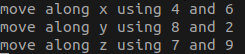

# PolygonMeshVirtualFixture
An application of the anatomical mesh-based virtual fixture for dVRK.


If you use our code, please cite
```
@article{li2020anatomical,
  title={Anatomical Mesh-Based Virtual Fixtures for Surgical Robots},
  author={Li, Zhaoshuo and Gordon, Alex and Looi, Thomas and Drake, James and Forrest, Christopher and Taylor, Russell H},
  journal={arXiv preprint arXiv:2006.02415},
  year={2020}
}
```

## Dependencies
- **cisst-saw**: Pleaes refer to documentation at link [here](https://github.com/jhu-cisst/cisst-saw).
- **3D Slicer**: We use 3D Slicer as a front end for visualization. To download, please use link [here](http://slicer.kitware.com/midas3/download/item/330417/Slicer-4.8.1-linux-amd64.tar.gz).
- **ROS-IGTL-Bridge**: We usee ROS-IGTL-Bridge to communicate between dVRK and Slicer. For installation instruction, please refer to documentation at link [here](https://github.com/openigtlink/ROS-IGTL-Bridge).
- **Python dependencies**: We use Python 3 to convert ROS messages to IGT to enable front end visualization. The easiest way to get ROS and Python environment is to set up a virtual environment. In order to do so:
    1. Install the following pacakge by `sudo apt install python3-venv python3-yaml python3-pip`. 
    2. Create your virtual environment by `python3 -m venv [NAME]`. 
    3. Then Python dependencies can be installed via `pip install -r scripts/requirements.txt`.

## To run the demo
### Simple teleop simulation
The demo runs a simple teleoperation that controlled by keyboard presses.
- Start roscore by `roscore`.
- Start the demo by `rosrun dvrk_mesh_vf simpleTeleop`.
- To control the position, start script by `python scripts/teleop.py` and follow the instruction. 


- To run visualization, please refer to the [**Visualization** section below](https://github.com/mli0603/PolygonMeshVirtualFixture#visualization).

### dVRK simulation
- Start roscore by `roscore`.
- Launch dVRK in simulation by `rosrun dvrk_robot dvrk_console_json -j share/console-MTMR_KIN_SIMULATED-PSM2Derived_KIN_SIMULATED-TeleopDerived.json`. Optionally, you can visualize the dVRK PSM by `roslaunch dvrk_robot dvrk_arm_rviz_only.launch arm:=PSM2`.
- To run visualization, please refer to the [**Visualization** section below](https://github.com/mli0603/PolygonMeshVirtualFixture#visualization).

### dVRK
- Start roscore by `roscore`.
- Base on the file `share/console-MTMR-PSM2Derived-TeleopDerived.json`, create a configuraiton file that matches your MTMR and PSM2 (or MTML and PSM1) serial number.
- Launch dVRK by `rosrun dvrk_robot dvrk_console_json -j share/console-MTMR-PSM2Derived-TeleopDerived.json`. 
- To run visualization, please refer to the [**Visualization** section below](https://github.com/mli0603/PolygonMeshVirtualFixture#visualization).

### Visualization
- Launch 3D slicer with the scene file located at `scene/Demo-Scene.mrml`. You should see a scene with pediatric skull and spheres. 


- Start ROS-IGTL-Bridge by `roslaunch ros_igtl_bridge bridge.launch`. Choose `Server` mode by typing `1`. Use port number `18944`.
- Connect to ROS-IGTL-Bridge by going to `Modules->IGT->OpenIGTLink IF`. Check `Active` box for status. 


- Start script by `python scripts/slicer.py` to convert ros messages to slicer messages. Use default registration by adding `--sr`.

## Log
- 2020.07.15: We are working on integrating some of the core components into [JHU-CISST Library](https://github.com/jhu-cisst/cisst) for minimal dependencies.

## Acknowledgement
Special thanks to [Anton Deguet](https://github.com/adeguet1) for helping open-sourcing the code :)
