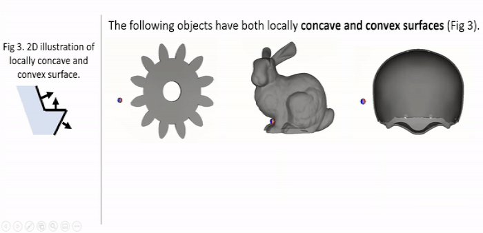
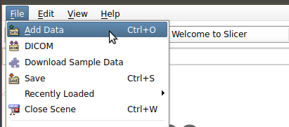
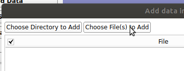
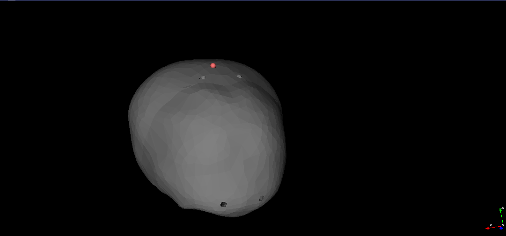
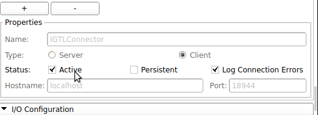
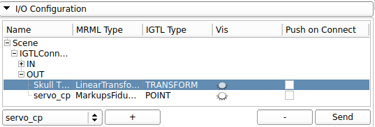
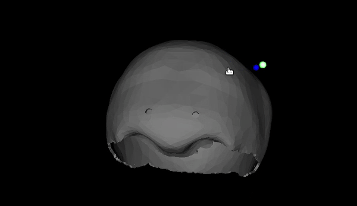
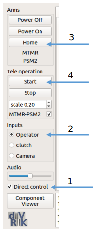
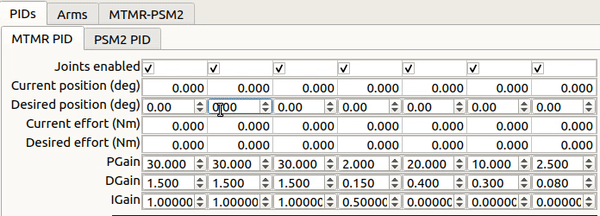

# Anatomical Mesh-Based Virtual Fixtures for Surgical Robots

This is the offical repo for our work [Anatomical Mesh-Based Virtual Fixtures for Surgical Robots](https://arxiv.org/abs/2006.02415) accepted in IROS 2020. We present a framework to **automatically generate arbitrary complex virtual fixtures** for any geometries given a polygon mesh (STL) file. The framework is integrated with core CISST-SAW libraries, thus **supports all CISST-based robots with a few lines of change**, including but not limited to dVRK and UR. To apply virtual fixture to your robot, there are very few lines needed to change in your control code. This repo contains [an interactive demo](https://github.com/mli0603/PolygonMeshVirtualFixture/tree/master#interactive-demo---simple-teleop) as well as example code of the virtual fixture working with [dVRK](https://github.com/mli0603/PolygonMeshVirtualFixture/tree/master#dvrk).

> 


If you find our work relevant, please cite
```
@article{li2020anatomical,
  title={Anatomical Mesh-Based Virtual Fixtures for Surgical Robots},
  author={Li, Zhaoshuo and Gordon, Alex and Looi, Thomas and Drake, James and Forrest, Christopher and Taylor, Russell H},
  journal={arXiv preprint arXiv:2006.02415},
  year={2020}
}
```
## Table of Content
- [System Requirement](https://github.com/mli0603/PolygonMeshVirtualFixture#system-requirement)
- [Dependencies](https://github.com/mli0603/PolygonMeshVirtualFixture#dependencies)
- [Compilation](https://github.com/mli0603/PolygonMeshVirtualFixture#compilation)
- [Demo](https://github.com/mli0603/PolygonMeshVirtualFixture#to-run-the-demo)
  - [Visualization](https://github.com/mli0603/PolygonMeshVirtualFixture#visualization)
  - [Interactive Demo](https://github.com/mli0603/PolygonMeshVirtualFixture#interactive-demo---simple-teleop)
  - [dVRK](https://github.com/mli0603/PolygonMeshVirtualFixture#dvrk)
  - [Simulated dVRK](https://github.com/mli0603/PolygonMeshVirtualFixture#simulated-dvrk)
- [Log](https://github.com/mli0603/PolygonMeshVirtualFixture#log)
- [Acknowledgement](https://github.com/mli0603/PolygonMeshVirtualFixture#acknowledgement)
## System Requirement
We have tested the code functionality on **Ubuntu 16.04 and 18.04**.

## Dependencies
- **3D Slicer**: We use 3D Slicer as a front end for visualization. It is required to use 3D Slicer 4.8.1 for OpenIGTLink compatibility. To download, please use this link [here](http://slicer.kitware.com/midas3/download/item/330417/Slicer-4.8.1-linux-amd64.tar.gz) and extract the files. Double click on the executable named `Slicer` to run 3D Slicer.
- **OpenIGTLink**: We use OpenIGTLink to communicate between 3D Slicer and CISST robot. To install, follow instruction [here](http://openigtlink.org/library/build). 
    - Note: you will need to `make install` after compiling the code.
    - Note: you will need to install the `SlicerIGT` extension in 3D Slicer. Please see [here](https://www.slicer.org/wiki/Documentation/4.8/SlicerApplication/ExtensionsManager#Installing_an_extension) for how to do so.
- **ROS**: To install ROS, pleaes follow instruction [here](http://wiki.ros.org/melodic/Installation/Ubuntu)
- **Third-Party Packages**: Please install by
  ```sh
  sudo apt install libxml2-dev libraw1394-dev libncurses5-dev qtcreator swig sox espeak cmake-curses-gui cmake-qt-gui git subversion gfortran libcppunit-dev libqt5xmlpatterns5-dev # most system dependencies we need
  sudo apt install python-wstool python-catkin-tools # catkin and wstool for ROS build
  ```

## Compilation
Please follow the following system command
```sh
source /opt/ros/melodic/setup.bash # or use whatever version of ROS is installed!
mkdir ~/catkin_ws # create the catkin workspace
cd ~/catkin_ws # go in the workspace
wstool init src # we're going to use wstool to pull all the code from github
catkin init
cd src # go in source directory to pull code
git clone https://github.com/mli0603/PolygonMeshVirtualFixture.git dvrk_mesh_vf # clone the code in a folder called dvrk_mesh_vf
wstool merge dvrk_mesh_vf/scripts/dvrk_mesh_vf.rosintall # add required repos
wstool up # now wstool knows which repos to pull, let's get the code
catkin build # ... and finally compile everything
```

## To run the demo
### Visualization
- Launch 3D slicer and load the demo scene.
  - Load the demo scene. Click on `File`, then `Add Data`.
  > 
  
  - Select `Choose File(s) to Add` and select the scene file located at `scene/Demo-Scene.mrml`. 
  
  > 

  - You should now see a scene with pediatric skull and two spheres (red and blue, but the spheres may overlap in the beginning so you only see one). 
  - The red sphere represents the servo-ed position (i.e. commanded position from the MTM or mouse) and the blue sphere represents the measured position (i.e. actual position with virtual fixture imposed). If the red sphere enters the skull, blue sphere should be stopped at the exterior shown in the [GIF](https://github.com/mli0603/PolygonMeshVirtualFixture#polygonmeshvirtualfixture).

  > 
- Connect to IGTL-Bridge.
  - Navigate to `Modules->IGT->OpenIGTLink IF`. Select the IGTL connector. 
    
    > 

  - Check `Active` box. 

    > 

### Interactive Demo - Simple teleop 
This interactive demo runs a simple teleoperation "robot" where the robot position (blue sphere) is controlled by the red sphere. Drag the red sphere to move the robot around. The robot is subject to the mesh virtual fixture, thus it cannot penatrate the skull.
- Follow [steps for visualization above](https://github.com/mli0603/PolygonMeshVirtualFixture#visualization).
- Source catkin workspace environment values by `source ~/catkin_ws/devel/setup.bash`
- Start roscore by `roscore`.
- Start the demo by `rosrun dvrk_mesh_vf simpleTeleop`.
- Transform the skull into robot coordinate frame by navigating to `Modules->IGT->OpenIGTLink IF` in 3D Slicer. In `I/O Configuration`, select `Skull to PSM` transformation and click on `Send`.

  > 
- To control the robot position (blue sphere), drag the red sphere. 

  > 

### dVRK
- Follow [steps for visualization above](https://github.com/mli0603/PolygonMeshVirtualFixture#visualization).
- Source catkin workspace environment values by `source ~/catkin_ws/devel/setup.bash`
- Start roscore by `roscore`.
- Base on the file `share/console-MTMR-PSM2Derived-TeleopDerived.json`, create a configuraiton file that matches your MTMR and PSM2 (or MTML and PSM1) serial number.
- Launch dVRK by `rosrun dvrk_robot dvrk_console_json -j share/console-MTMR-PSM2Derived-TeleopDerived.json`. 
- Transform the skull into robot coordinate frame by navigating to `Modules->IGT->OpenIGTLink IF` in 3D Slicer. In `I/O Configuration`, select `Skull to PSM` transformation and click on `Send`.

  > 

### Simulated dVRK
- Follow [steps for visualization above](https://github.com/mli0603/PolygonMeshVirtualFixture#visualization).
- Source catkin workspace environment values by `source ~/catkin_ws/devel/setup.bash`
- Start roscore by `roscore`.
- Start the simulated console by `rosrun dvrk_robot dvrk_console_json -j share/console-MTMR_KIN_SIMULATED-PSM2Derived_KIN_SIMULATED-TeleopDerived.json.` Optionally, you can visualize the PSM by `roslaunch dvrk_robot dvrk_arm_rviz_only.launch arm:=PSM2.`
- Inform teleoperation logic that PSM is simulated by `rostopic pub -1 /PSM2/set_simulation std_msgs/Bool "data: true"`



- In the console, first setup teleoperation 

  1. Check `Direct Control`
  2. Enable `Operator`
  3. `Home` the robot
  4. `Start` teleoperation.
</br></br></br></br>
  
- Move the second joint of MTM such that its value is 20. This step moves the tip above the skull.
  - Enable `Direct Control` in `MTMR` tab.
  - Change the joint value, click `Move`.
    - NOTE: you have to set it to 10 then 20 to avoid large joint motion.
  - Now you should see the tool tip is above the skull in 3D Slicer.
  > 
- Transform the skull into robot coordinate frame by navigating to `Modules->IGT->OpenIGTLink IF` in 3D Slicer. In `I/O Configuration`, select `Skull to PSM` transformation and click on `Send`.

  > 
- In the console, 
  - Adjust the second joint such that its value is 10
  - Now you should see the tool tip (blue sphere) is stopped at the exterior of the skull in 3D Slicer, while the MTM (red sphere) passes through the skull, demonstrating VF is working.

## Log
- 2020.10.06: We have finished upgrading our code to be [crtk](https://collaborative-robotics.github.io/iros-2018-tutorial.html) compatible.
- 2020.09.21: We have moved core funcitonalities of handling mesh into CISST library as cisst-mesh component in branch [devel](https://github.com/jhu-cisst/cisst/tree/devel). We are working on upgrading the exisitng code base to be [crtk](https://collaborative-robotics.github.io/iros-2018-tutorial.html) compatible.
- 2020.07.15: We are working on integrating some of the core components into [JHU-CISST Library](https://github.com/jhu-cisst/cisst) for minimal dependencies.

## Acknowledgement
Special thanks to [Anton Deguet](https://github.com/adeguet1) for helping open-sourcing the code :)
